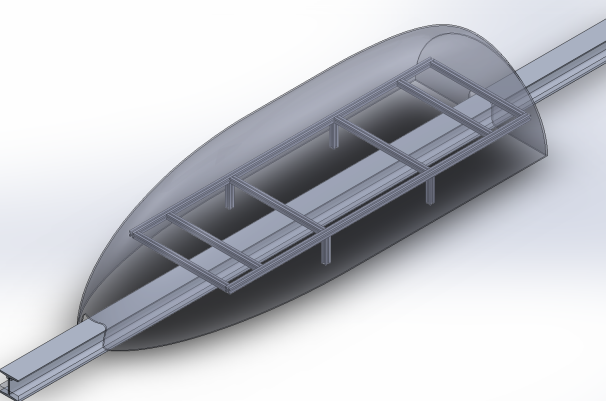
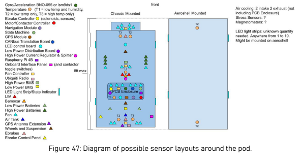

# T_SWE_2019_2020
Software for AlbertaLoop's first-generation pod.

A rendering of the pod's aeroshell.

An initial mock-up of the electronics layout.

# Setup
We use pre-commit hooks to ensure code standardisation. These hooks will automatically make changes to staged code, based on the rules configured in _pre-commit-config.yaml_.

You will have to install [pre-commit](https://pre-commit.com/) to make changes to the repository. To install pre-commit, follow the instructions on the website.

# Repository guidelines

# Github
The general guideline for Github is to always develop on your own branch. After a feature is ready, create a pull request for the branch you are working on and have a senior member of the team review and approve your pull request. Once a pull request has been approved, it can be merged into the master branch. If you are unsure of how to merge, please ask a senior member of the team for guidance.

## Github Branches
Use "-" character to separate words in a branch name. Example: rutvik-gui. Try to name each branch to highlight **who** is working on the feature, and **what** the feature is.

## Github Commit Messages
Commit messages must accurately and briefly explain what change you are making. Try to be concise.
