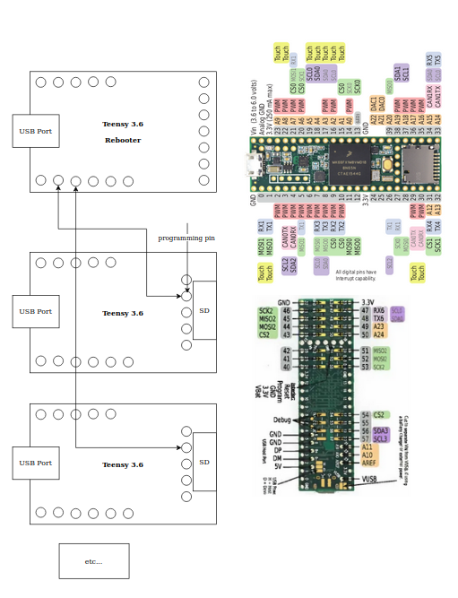

# Teensy Rebooter
As Paul Stoffregen mentions on the [forums](https://forum.pjrc.com/threads/26929-Remote-reboot-user-code-update?p=57067&viewfull=1#post57067)

> However, if Teensy has crashed with interrupts disabled or turned off its USB port or entered a low power mode where USB doesn't work, then it can't hear the auto-reboot request. Every Teensy has a pushbutton for exactly this reason, so you can recover from loading such programs.

> The more expensive approach involves using another Teensy (or any remotely controllable hardware) to pulse the PROGRAM pin low, causing a reboot into programming mode. The command line loader features a "rebootor" example on a Teensy 2.0 which does this.... it simply listens for a request to reboot and pulses a pin low. Simple, except it adds more hardware. But if you want highly reliable rebooting, this is the only way that protects you from an unrecoverable situation where a remotely loaded program crashes in such a manner than it can't hear reboot requests.

This is the software program written to be run on a "Rebooter Teensy", which pulses the PROGRAM pin low.

In the GIF below, you see us
1. flash this program onto the rebooter Teensy
2. connect to the program using `picocom`
3. select pin 0 (by typing 0 in our keyboard)
    * in the left pane, you will see a Teensy go from USB serial to HalfKey mode
4. select pin 1 (by typing 1 in our keyboard)
    * in the left pane, you will see a Teensy go from USB serial to HalfKey mode

Here is a sample connection diagram with two Teensies to be programmed connected to one Rebooter Teensy.

# Setup
1. open this project in PlatformIO and build it
    * or use a pre-built .hex file if one is available for your Teensy
2. move the resulting _firmware.hex_ file to your remote computer
    * you can do thsi with `scp`, `rsync`, etc...
3. flash _firmware.hex_ onto the Teensy
    * you can do this with `teensy_loader_cli`, `tycmd`, etc...
4. open the serial port for your Teensy
    * you can do this with `picocom`
5. follow the on screen instructions